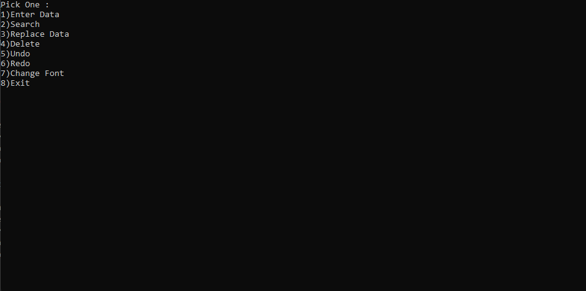

# 4dLinkedList
Designed a 4D Linked List Notepad application in C++

## Pre-Requisities
Visual Studio - IDE

## **Setup**
* Create clone of this repository in your directory.
* Open 4DLinkedList.cpp.
* Execute the .cpp file in the Visual Studio.
* Select option 1 to enter data.
* Debug the project to understand the 4D linked list process.

### **Screenshots**

